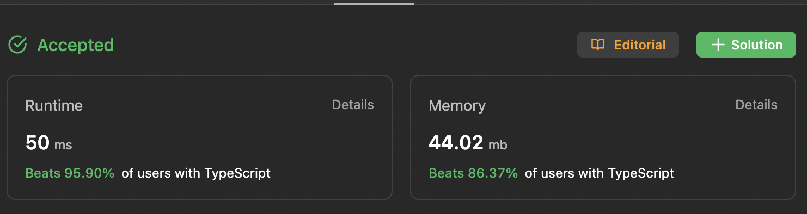

# 1768. Merge Strings Alternately

| Level | Time       | Date            |
| ----- | ---------- | --------------- |
| Easy  | 10 minutes | Sat, 5 Aug 2023 |

## Intuition

Traverse through each character in both strings while merging the two character at the same index.

## Pseudocode

```
result = "";
maxLength = the max between the length of word1 and word2
index = 0;

while (index < maxLength):
    if (word1 has char at index):
        add word1[index] to result

    if (word2 has char at index):
        add word2[index] to result

    increment index by +1

return result;
```

## Complexity

| Time   | Space      |
| ------ | ---------- |
| `O(k)` | `O(n + m)` |

- **Time Complexity**

  - `O(k)`: The number of iteration would be `k` times where `k` is the biggest number between `n` and `m` (so `k <= n` && `k <= m`).

- **Space Complexity**
  - `O(m + n)`: the new string (result of the merging between `word1` and `word2`) would have `m + n` characters long.

## Code

```typescript
function mergeAlternately(word1: string, word2: string): string {
  let result: string = "";
  const maxLength: number = Math.max(word1.length, word2.length);
  let index: number = 0;

  while (index < maxLength) {
    if (word1.length > index) result += word1[index];
    if (word2.length > index) result += word2[index];

    index += 1;
  }

  return result;
}
```

## Submission


