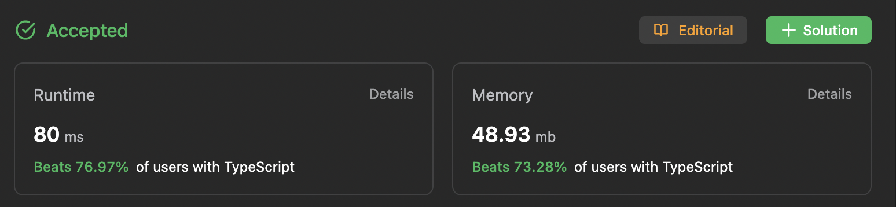

# 345. Reverse Vowels of a String

| Level | Time       | Date            |
| ----- | ---------- | --------------- |
| Easy  | 20 minutes | Sat, 5 Aug 2023 |

## Approach

1. Init two indexes pointing the first and last characters in the string.
2. If the characters at those two indexes are vowels, swap them.
3. Keep doing this as long as the first index is still less than the last index.

## Complexity

| Time       | Space  |
| ---------- | ------ |
| `O(n / 2)` | `O(n)` |

- **Time Complexity**

  - `O(n / 2)`: Traverse through each character using two pointers starting from the first & last characters in the string while swapping them when they are vowels.

- **Space Complexity**
  - `O(n)`: An array to store the reversed characters.

## Code

```typescript
function reverseVowels(s: string): string {
  if (s.length === 1) return s;

  const VOWELS = new Set(["a", "i", "u", "e", "o", "A", "I", "U", "E", "O"]);

  const reversedChars = [...s];
  let index1 = 0;
  let index2 = s.length - 1;

  while (index1 < index2) {
    if (!VOWELS.has(reversedChars[index1])) index1 += 1;

    if (!VOWELS.has(reversedChars[index2])) index2 -= 1;

    if (
      VOWELS.has(reversedChars[index1]) &&
      VOWELS.has(reversedChars[index2])
    ) {
      const char1 = reversedChars[index1];

      reversedChars[index1] = reversedChars[index2];
      reversedChars[index2] = char1;

      index1 += 1;
      index2 -= 1;
    }
  }

  return reversedChars.join("");
}
```

## Submission


