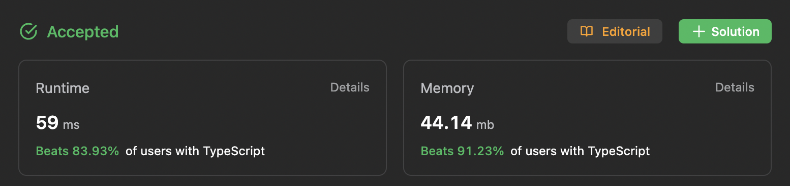

# 151. Reverse Words in a String

| Level  | Time       | Date            | Problem                                                                                                             |
| ------ | ---------- | --------------- | ------------------------------------------------------------------------------------------------------------------- |
| Medium | 10 minutes | Sun, 6 Aug 2023 | [URL](https://leetcode.com/problems/reverse-words-in-a-string/description/?envType=study-plan-v2&envId=leetcode-75) |

## Approach

1. Convert the string into non-empty-string array.
2. Reverse the strings in the array.
3. Re-convert the reversed strings array into a string.

## Complexity

| Time   | Space  |
| ------ | ------ |
| `O(n)` | `O(n)` |

## Code

```typescript
function reverseWords(s: string): string {
  const words: string[] = s.split(" ").filter((word) => {
    return word.trim() != "";
  });

  if (words.length === 1) return words[0];

  let index1 = 0;
  let index2 = words.length - 1;

  while (index1 < index2) {
    // swap
    const word1 = words[index1];
    words[index1] = words[index2];
    words[index2] = word1;

    index1 += 1;
    index2 -= 1;
  }

  return words.join(" ");
}
```

## Submission


