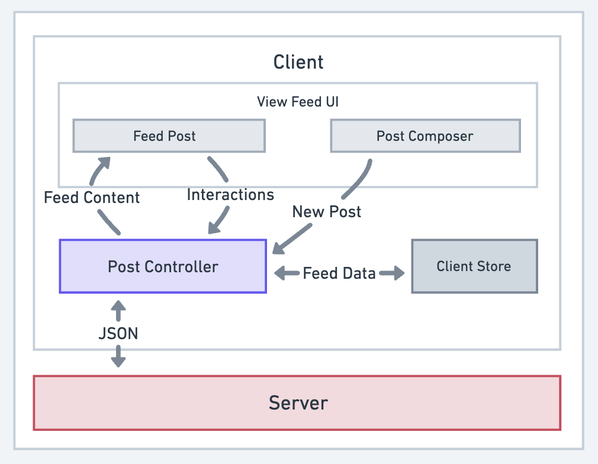
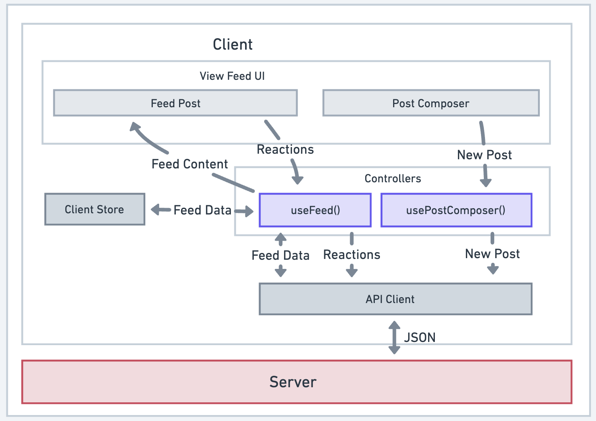
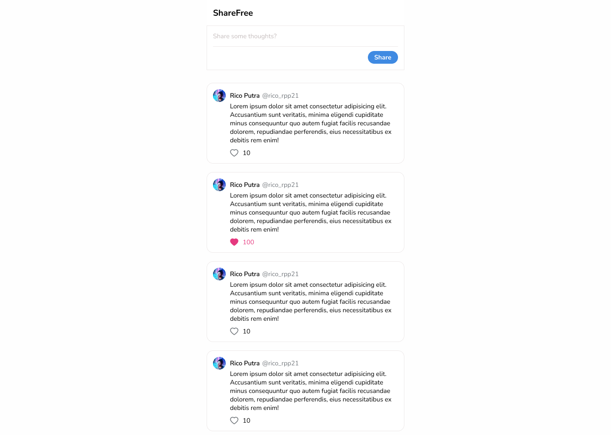

##### CHANGELOG

| Version | Date              | Changes                                                                                                                  |
| ------- | ----------------- | ------------------------------------------------------------------------------------------------------------------------ |
| 1.0     | Sun, 30 July 2023 | Doc is created                                                                                                           |
| 1.1     | Sun, 30 July 2023 | Add a new core feature, more context of the users, and caching mechanism                                                 |
| 1.2     | Sun, 30 July 2023 | Add a user interface for the Feed UI                                                                                     |
| 1.3     | Wed, 2 Aug 2023   | Add a **8. Development** section to explain about the tech stacks, functional requirements, and list of tasks to be done |
| 1.4     | Wed, 4 Aug 2023   | Add a **8.4 Deployment** section to explain the URL/link where users would be able to access this web app                |
| 1.5     | Wed, 5 Aug 2023   | Adjust part **1.5** in **1.Requirement Exploration** section and **6. Caching** section based on the changes in **1.5**. |

---

# Social Media Feed

**Task**: Please make me a system design for a social media feed application that displays a list of feed posts created by the users and they are able to interact with the posts.

## 1. Requirement Exploration

### 1.1. What are the core features to be supported?

1. Browse feed containing posts created by the users.
2. Create a new post.
3. Like a post.
4. Displaying new posts created by other users in realtime (_live_).

### 1.2. What kind of posts are supported?

Currenlty it's only a **plain text** are supported to be the content of a post.

### 1.3. What pagination UX should be used for the feed?

**Infinite scrolling**: more posts will be added when the user reaches the end of their feed (bottom).

### 1.4. What kind of UX should be used for displaying the new posts that are created by other users in realtime?

A **small popup** with a label **"New posts..."** will be displayed on the top of the feed.

### 1.4. Will the app be used on mobile devices?

Yes.

### 1.5. Is there any additional information?

This app will be used as an **SaaS for company**. All **data** (posts, replies, etc) will be **stored privately for each company**. So it **won't be shared globally** like other social media apps (Twitter, Facebook, and Instagram).

"_**Why does a company want to use such app?**_".
This app will be used as a **knowledge sharing tool** to enable employees to share their knowledge in a more relaxed way. This is **asynchronous**, so everyone can interacts anywhere & anytime they want.

_**Why not just using Slack?**_
Based on the **data gathered** by our research team, **Slack** or other similar realtime messaging apps feels like **forcing us to immediately give response** to the messages. It feels quite **annoying** for them. They prefer a **more asynchronous way** for doing knowledge sharing.

---

## 2. Architecture/High-level Design

### 2.1. High-Level View



### 2.2. More Detailed View



### Component Responsibility

- **Server**: Provides HTTP APIs to **fetch posts** and to **create new feed posts**.
- **Post Controller**: controls the flow of data within the application and makes network requests to the server. In **React**, may create a **custom hook** like `usePostController()`.
- **Client Store**: Stores data needed across the whole or parts of application like feed posts and users data.
- **Feed UI**: Displaying a list of feed posts and the UI for composing a new post.
  - **Feed Post**: Displaying a single `Post` component where the text-based content and a button to interact (Like) are being displayed.
  - **Post Composer**: A text input field for the users to write the post content, button `Cancel` to cancel the action, and button `Create` to create the new post.

---

## 3. Data Model

| Entity    | Source              | Belongs To       | Fields                                                           |
| --------- | ------------------- | ---------------- | ---------------------------------------------------------------- |
| `Feed`    | Server              | Feed UI          | `posts` (list of `Post`s) and `pagination` (pagination metadata) |
| `Post`    | Server              | Feed Post        | `id`, `created_time`, `content`, `author` (a `User`), `likes`    |
| `User`    | Server              | Client Store     | `id`, `username`, `password`, `email`, `name`, `profile_pic_url` |
| `NewPost` | User Input (client) | Post Composer UI | `content`                                                        |

---

## 4. Database

Based on the requirements mentioned in #1.5 above, this app will be used **internally within the company**. So, the users **won't be as big as Twitter**, Facebook, and Instagram which are used globally in the world.

Actually, there will be two type of DB to use: **SQL** and **NoSQL**

- **SQL**: for storing **users** data
- **NoSQL**: for storing **posts** data

I think there are another choices like **GraphDB** that will be suitable for social media app. However, I don't really know about it yet. So, let's just use **SQL** and **NoSQL** for now and talk about it later if we still have some more time. I am open to your suggestions about what database would be the best suited for the bigger version of this app.

### 4.1. `USER` Table in SQL

| Field                 | Type           | Null | Default | Extra              |
| --------------------- | -------------- | ---- | ------- | ------------------ |
| `id`                  | `INT`          | -    | -       | Primary Key        |
| `username`            | `VARCHAR(50)`  | -    | -       | Unique             |
| `password`            | `VARCHAR(100)` | -    | -       |                    |
| `email`               | `VARCHAR(100)` | -    | -       | Unique             |
| `name`                | `VARCHAR(100)` | -    | -       |                    |
| `profile_picture_url` | `VARCHAR(200)` | -    | -       |                    |
| `active`              | `INT`          | -    | 1       |                    |
| `company_id`          | `INT`          | -    | -       | FK to `COMPANY.id` |

### 4.2. `COMPANY` Table in SQL

| Field      | Type           | Null | Default | Extra       |
| ---------- | -------------- | ---- | ------- | ----------- |
| `id`       | `INT`          | -    | -       | Primary Key |
| `name`     | `VARCHAR(50)`  | -    | -       | Unique      |
| `email`    | `VARCHAR(100)` | -    | -       | Unique      |
| `password` | `VARCHAR(100)` | -    | -       |             |
| `active`   | `INT`          | -    | 1       |             |

### 4.3. `POST` Data Model NoSQL

```typescript
type Post = {
  id: number;
  content: string;
  created_time: number;
  author_id: number; // FK to `USER.id` in SQL
  likes: number[]; // contains the ID of users who like the post
};
```

## 5. Interface Definition (API)

### 5.1. General API Definition

| Source        | Destination | API Type   | Functionality                                              |
| ------------- | ----------- | ---------- | ---------------------------------------------------------- |
| Server        | Controller  | HTTP       | Fetch feed posts                                           |
| Controller    | Feed UI     | Javascript | Transfer the feed posts data to be displayed in the UI     |
| Controller    | Server      | HTTP       | Create a new post; like a post                             |
| Post Composer | Controller  | Javascript | Transfer new post content to be sent to the server         |
| Feed Post     | Controller  | Javascript | Transer new like/unlike on a post to be sent to the server |

### 5.2. HTTP API

| Description        | HTTP Method | Path                     | Request Body                     |     |
| ------------------ | ----------- | ------------------------ | -------------------------------- | --- |
| Get the feed posts | `GET`       | `/posts`                 |                                  |     |
| Create a new post  | `POST`      | `/posts`                 | `{ content: string }`            |     |
| Like/unlike a post | `POST`      | `/posts/<post_id>/likes` | `{ action: ["like", "unlike"] }` |     |

### 5.3. Pagination

Instead of getting all the feed posts at once and display all of them on the UI, it is better to slice the posts into some parts using pagination. The question is what will be the most suitable approach to be used for the pagination? Let's find it out together!

The app we're going to develop is a social media feed app. Such app has two characteristics as below:

- Data **changes** occur **frequently** (i.e. new posts are created).
- No need to **"jump" into a specific group of posts** (like changing to a specific page in a data table).

Based on the characteristics above, we think the suitable approach is to use **Cursor-based Pagination**.

---

## 6. Caching

The main data that will be **changed frequently** is the **feed posts**. There will be many posts created in seconds or minutes. The other one, **users data**, seems **won't be changing too frequent**. So, it is a good idea to **cache the users data** in order to reduce the loading time.

There are two ways to cache the users data, either on the **server** or on the **client**.

- **Server**
  When the **number of users is huge** (like Twitter & Instagram users around the world), it is **more suitable** to cache the users data in the **server**. We can user **in-memory databases** like **Redis** or **Memcached** to cache the users data.

- **Client**
  Otherwise, when the **number of users is small**, caching the data on the **client** would be more suitable because it is **cheaper** than **allocating extra resource** on the server for caching (i.e. Redis).

In this scenario, this app will be used as an **SaaS** for companies. There might be quite **big number of users**. So it would be good if we do **caching** on the **server-side**. The idea is, whenever the client send an **HTTP Request** to the server to get the latest **posts** data, the server will retrieve the **users** data from **Redis**.

## 7. User Interfaces

### 7.1. Feed UI



## 8. Development

### 8.1. Tech Stacks

For practicing purpose, we will develop this web app using simple tech stacks.

- **Web**: NextJS 13 (Pages & API Routes)
- **Zustand**: Client State Management
- **SQL DB**: Sqlite + Prisma ORM
- **NoSQL DB**: Firebase Realtime DB
- **Images Bucket**: Supabase Storage
- **Redis**: Upstash

### 8.2. Functional Requirements

1. **Browse feed** containing posts (_text-only_) created by the users.
2. **Create** a new post.
3. **Like/unlike** a post.
4. When there is a **new post** created by other user:
   1. The browser will be able to **catch that event** and display a **small popup** with a label **"New posts...** on the **top** of the feed.
   2. When user **clicks** on that small popup, **the new posts will be displayed on the top of all previous posts** in the feed.
5. When user **scroll down** the feed, at some point, the browser will **start re-fetching the next (later/older) posts** to be displayed **after the last post** available in the feed.
   1. When the re-fetching is **not finished yet**, a small **loading spinner** will be displayed **after the last post** in the feed.

### 8.3. Tasks

#### 8.3.1. Frontend

- [x] **FeedStore** client store.
- [x] **useInit** custom hook.
- [x] **useFeed** custom hook.
- [x] **usePostComposer** custom hook.
- [x] **PostAPI** API client.
- [ ] **PostReaction** component.
- [x] **Post** component.
- [x] **Button** component.
- [x] **PostComposer** component.
- [ ] **Feed** component.
- [ ] **PopupNewPosts** component.
- [ ] **LoadingSpinner** component.

#### 8.3.2. Backend

1. **Get Feed Posts** endpoint.
2. **Create New Post** endpoint.
3. **Like/unlike Post** endpoint

#### 8.3.3. DB Seeder

Let's do the simplest. We will explain to ChatGPT about our app, provide the data model, and ask it to create us good dummy data in JSON. So, the only thing we need to do on the source code is only to create a function to store the dummy data in DB using that JSON file created by ChatGPT.

### 8.4. Deployment

For exploration purpose, this web app will be deployed on Vercel. The result can be accessed on https://sharefree.vercel.app/.

# References

This system design is created by following the example of [News Feed (e.g. Facebook)](https://www.greatfrontend.com/questions/system-design/news-feed-facebook) system design provided by [GreatFrontEnd](https://www.greatfrontend.com/).
